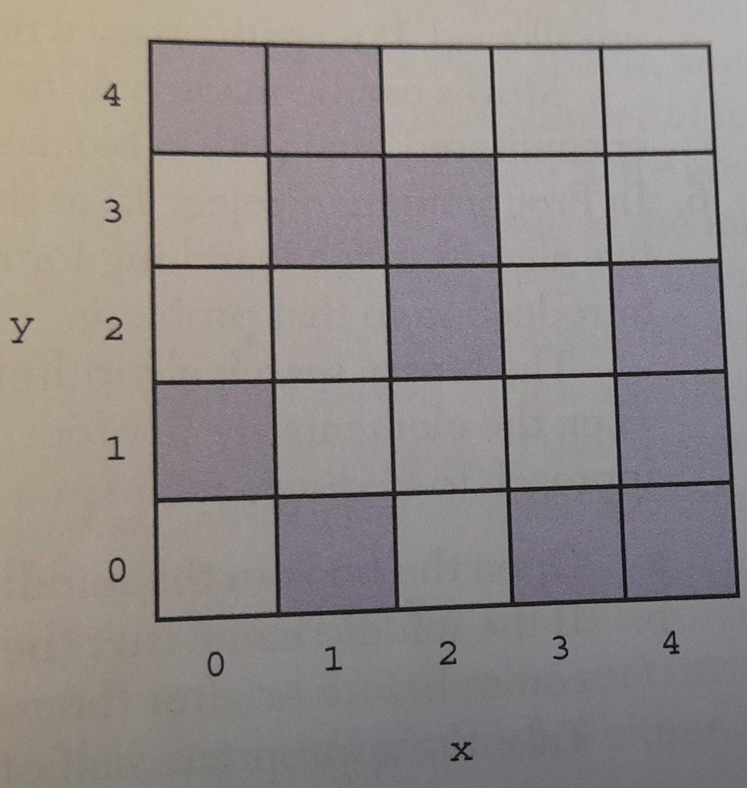

# IMPR-Lecture-11
For de fleste af dagens opgaver er det passende at
1) implementere funktionen i et lille bibliotek, og
2) skrive en eller flere tests af funktionen ved brug af CTest

## Gruppeopgaver
- [Opgave 11.3](src/exercise-11.3.c) (Heltalsdivision og restuddragning med rekursive funktioner - en forholdsvis let 'kom i gang opgave' - også hjemmeopgave). [KN Slides](https://homes.cs.aau.dk/~normark/impr-c/recursion-power3-slide-exercise-1.html)
- [Opgave 1 side 587](src/exercise-PSPDC-587-1.c) i Problem Solving and Program Design in C, eighth edition.
[Hint og hjælp til opgaven (= opgave 11.4)](https://homes.cs.aau.dk/~normark/impr-c/recursion-opgaver-slide-exercise-1.html).
  - Develop a program to count pixels (picture elements) belonging to an object in a photograph.
  - The data are in a two-dimensional grid of cells, each of which may be empty (value `0`) or filled (value `1`).
  - The filled cells that are connected form a blob (an object). Figure 9.27 shows a grid with three blobs.
  - Include in your program a function `blob_check` that takes as parameters the grid and the _x-y_ coordinates of a cell and returns as its value the number of cells in the blob to which the indicated cell belongs.
  - Function `blob_check` must test whether the cell specified by its arguments is filled.
  - The cell (`x, y`) may not be on the grid, or the cell (`x, y`) may be empty.
  - In either of these cases, the value returned by `blob_check` is `0`.
  - If the cell is on the grid and filled, then the value returned is `1` plus the sizes of the blobs containing each of its eight neighbours.
  - To avoid counting a filled cell more than once, mark a cell as empty once you have counted it.

- [Opgave 11.1](src/exercise-11.1.c) (En Fibonacci funktion med huskeværk) [KN Slides](https://homes.cs.aau.dk/~normark/impr-c/recursion-fib3-slide-exercise-1.html)
- [Opgave 11.5](src/exercise-11.5.c) (Rekursive udgaver af Euclids algorime) [KN Slides](https://homes.cs.aau.dk/~normark/impr-c/recursion-opgaver-slide-exercise-2.html)
- [Opgave 10.2](src/exercise-10.2.c) (Din egen rekursive udgave af strcmp) [KN Slides](https://homes.cs.aau.dk/~normark/impr-c/strings-strcmp-slide-exercise-1.html)

## Hjemmeopgaver
- [Opgave 3 side 588](src/exercise-PSPDC-588-3.c) i Problem Solving and Program Design in C, eighth edition.
  - Write and test a recursive function that returns the value of the following recursive definition:
    - _f(x) = 0_ if _x <= 0_
    - _f(x) = f(x-1) + 2_ otherwise
  - What set of numbers is generated by this definition?
- [Opgave 11.3](src/exercise-11.3.c) (Heltalsdivision og restuddragning med rekursive funktioner) [KN Slides](https://homes.cs.aau.dk/~normark/impr-c/recursion-power3-slide-exercise-1.html)
